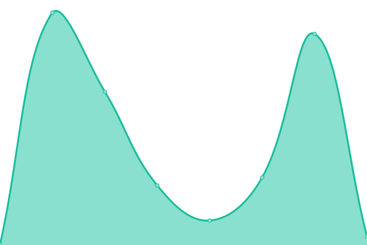

# [📈 Live Status](https://Deadreyo.github.io/upptime-test): <!--live status--> **🟩 All systems operational**

This repository contains the open-source uptime monitor and status page for [NightKnight](https://www.linkedin.com/in/ahmed-mohamed-atwa/), powered by [Upptime](https://github.com/upptime/upptime).

With [Upptime](https://upptime.js.org), you can get your own unlimited and free uptime monitor and status page, powered entirely by a GitHub repository. We use [Issues](https://github.com/Deadreyo/upptime-test/issues) as incident reports, [Actions](https://github.com/Deadreyo/upptime-test/actions) as uptime monitors, and [Pages](https://Deadreyo.github.io/upptime-test) for the status page.

<!--start: status pages-->
<!-- This summary is generated by Upptime (https://github.com/upptime/upptime) -->
<!-- Do not edit this manually, your changes will be overwritten -->
<!-- prettier-ignore -->
| URL | Status | History | Response Time | Uptime |
| --- | ------ | ------- | ------------- | ------ |
|  [insights.opensauced.pizza](https://insights.opensauced.pizza/) | 🟩 Up | [insights-opensauced-pizza.yml](https://github.com/open-sauced/status.opensauced.pizza/commits/HEAD/history/insights-opensauced-pizza.yml) | 

 292ms
     
 | 

<a href="https://status.opensauced.pizza/history/insights-opensauced-pizza">99.98%</a>
    

|  [hot.opensauced.pizza](https://hot.opensauced.pizza/) | 🟩 Up | [hot-opensauced-pizza.yml](https://github.com/open-sauced/status.opensauced.pizza/commits/HEAD/history/hot-opensauced-pizza.yml) | 

 318ms
     
 | 

<a href="https://status.opensauced.pizza/history/hot-opensauced-pizza">100.00%</a>
    

|  [api.opensauced.pizza](https://api.opensauced.pizza/) | 🟩 Up | [api-opensauced-pizza.yml](https://github.com/open-sauced/status.opensauced.pizza/commits/HEAD/history/api-opensauced-pizza.yml) | 

 386ms
     
 | 

<a href="https://status.opensauced.pizza/history/api-opensauced-pizza">100.00%</a>
    

|  [app.opensauced.pizza](https://app.opensauced.pizza/) | 🟩 Up | [app-opensauced-pizza.yml](https://github.com/open-sauced/status.opensauced.pizza/commits/HEAD/history/app-opensauced-pizza.yml) | 

 212ms
     
 | 

<a href="https://status.opensauced.pizza/history/app-opensauced-pizza">99.98%</a>
    

|  [docs.opensauced.pizza](https://docs.opensauced.pizza/) | 🟩 Up | [docs-opensauced-pizza.yml](https://github.com/open-sauced/status.opensauced.pizza/commits/HEAD/history/docs-opensauced-pizza.yml) | 

 213ms
     
 | 

<a href="https://status.opensauced.pizza/history/docs-opensauced-pizza">100.00%</a>
    

|  [explore.opensauced.pizza](https://explore.opensauced.pizza/) | 🟩 Up | [explore-opensauced-pizza.yml](https://github.com/open-sauced/status.opensauced.pizza/commits/HEAD/history/explore-opensauced-pizza.yml) | 

 134ms
     
 | 

<a href="https://status.opensauced.pizza/history/explore-opensauced-pizza">100.00%</a>
    

<!--end: status pages-->

[**Visit our status website →**](https://Deadreyo.github.io/upptime-test)

## 📄 License

- Powered by: [Upptime](https://github.com/upptime/upptime)
- Code: [MIT](./LICENSE) © [NightKnight](https://www.linkedin.com/in/ahmed-mohamed-atwa/)
- Data in the `./history` directory: [Open Database License](https://opendatacommons.org/licenses/odbl/1-0/)
